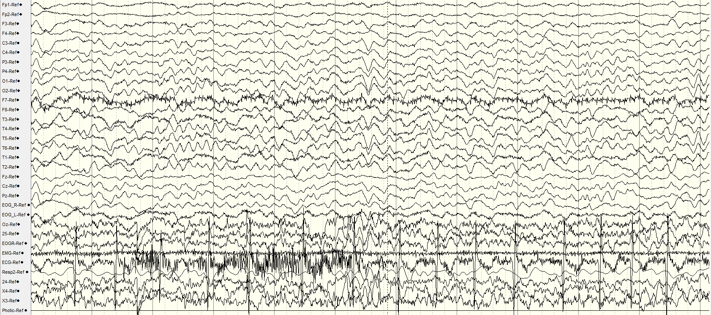

# Generative Diffusion Model of Epileptic EEG Spike Detection for Data Augmentation
<p align="center">
   
</p>

* This repository consist of code for implementation in "Generative Diffusion Model of Epileptic EEG Spike Detection for Data Augmentation"

## Abstract
Epilepsy diagnosis relies significantly on Electroencephalogram (EEG) analysis, particularly the detection of interictal epileptiform discharges (IEDs), such as spikes. Manual identification of these discharges is time-intensive. Despite existing automated methods, clinical adoption remains limited due to suboptimal performance by the classifiers built for detecting the spike. The main approach to automate this task is using deep learning classifier. However, there is a lack in combining deep learning and generative model-based approaches in automated epileptic spike detection. This study utilizes the classifier-free guidance diffusion model for data augmentation using WaveGrad architecture by training on multi-electrode EEG data. Besides, this study proposes a preprocessing technique to enhance the model’s focus while retaining the most useful information. Results show that the deep learning classifiers’ performance is increased after training on the data synthesized by the diffusion model.

## Working directories

```
   |---Image
   |---EEG_Dataset
       |---patientID_1
           |--- patientID_1.edf
       |---patientID_2
           |--- patientID_2.edf
       ...
       |---patientID_n
           |--- patientID_n.edf
   |---EEG_csv  # Auto generated folder
       |---eeg1.csv
       |---eeg2.csv
       ...
       |---eeg40.csv
       |---annotation.json
   |---Model         # Auto-generated folder if it does not exist
   |---visualization # Auto-generated folder if it does not exist

   |---0_EDF_file_analysis.ipynb
   |---0_Pre-process_EDF_FILE.ipynb
   |---1_Visualize_EEG_Signal.ipynb
   |---2_Training_Diffusion_Model.ipynb
   |---3_Training_Classifiers.ipynb
   |---3_Training_Diffusion_Classifiers.ipynb
   |---4_Evaluate_Diffusion_Model.ipynb
   |---5_Training_Classifiers_with_synthesized_data.ipynb
   |---6_Label_EEG_data.ipynb

   |---model.py    # Contain the Neural Network implementation in pytorch
   |---settings.py # All the settings
   |---utility.py  # Utility function

   |---requirements.txt
   
   
```

## Way to run the code
1. Install all the dependency library in your python environment. 

    ```pip install -r requirements.txt```
> *Make sure you have [Pytorch](https://pytorch.org/get-started/locally/) installed in your environment.* 

2. Place your EEG data in '.edf' format into the 'EEG_dataset' directory

3. Analyze your EEG data using [0_EDF_file_analysis.ipynb](https://github.com/xinjue37/Generative-Diffusion-Model-of-Epileptic-EEG-Spike-Detection-for-Data-Augmentation/blob/main/0_EDF_file_analysis.ipynb)

4. Adjust the settings in '[settings.py](https://github.com/xinjue37/Generative-Diffusion-Model-of-Epileptic-EEG-Spike-Detection-for-Data-Augmentation/blob/main/settings.py)' based on your EEG data's properties

5. Preprocess the EDF file into csv file using [0_Pre-process_EDF_FILE.ipynb](https://github.com/xinjue37/Generative-Diffusion-Model-of-Epileptic-EEG-Spike-Detection-for-Data-Augmentation/blob/main/0_Pre-process_EDF_FILE.ipynb), the EEG_csv folder is auto generated

6. Visualize your EEG data before and after preprocess. Repeat from step 4 if the visualization does not meet your expectation

7. Train and evaluate the diffusion model and classifiers by consequently running the jupyter notebook file '[2_Training_Diffusion_Model.ipynb](https://github.com/xinjue37/Generative-Diffusion-Model-of-Epileptic-EEG-Spike-Detection-for-Data-Augmentation/blob/main/2_Training_Diffusion_Model.ipynb)', '[3_Training_Classifiers.ipynb](https://github.com/xinjue37/Generative-Diffusion-Model-of-Epileptic-EEG-Spike-Detection-for-Data-Augmentation/blob/main/3_Training_Classifiers.ipynb)', ...
